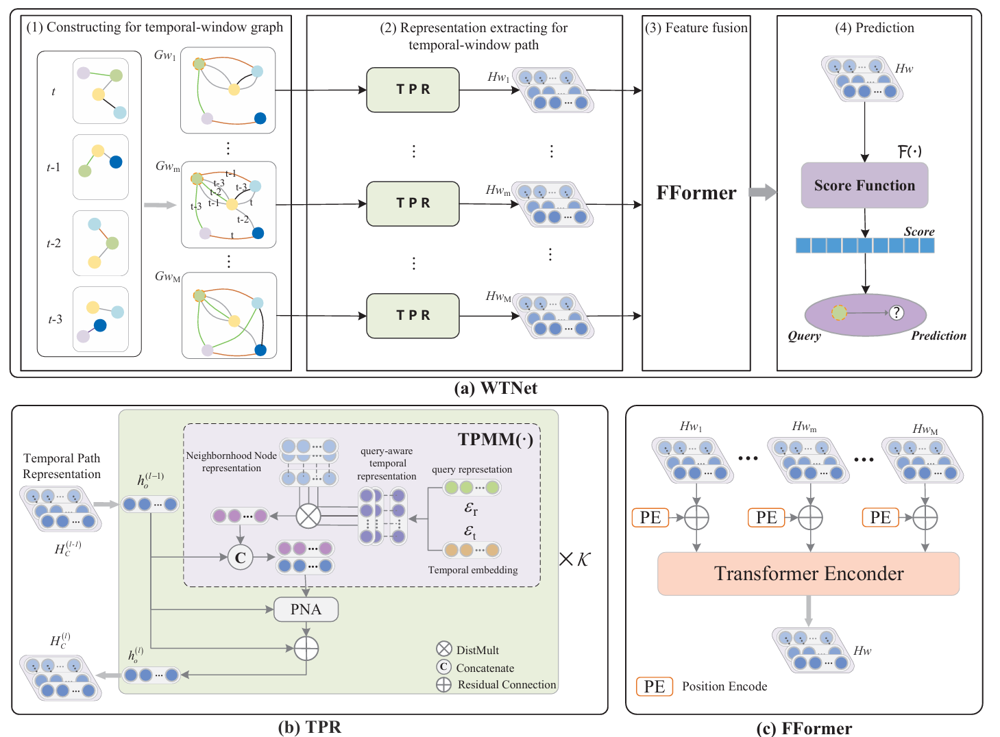

# WTNet: Temporal Knowledge Graph Reasoning Network with Windowing Strategy and Transformer-based Fusion
 Authors: Jiabin Zhang, Min Wangb, Guoqiang Xie and Jianrong Peng
## Description

1. This repository contains the code for the WTNet model mentioned in the article. 

2. WTNet Architecture:



3. This repository contains the following contents:
```
/
├── data/                   --> (The folder containing three used datasets)   
|   ├── WIKI/               --> (The WIKI dataset.)
|   ├── YAGO/               --> (The YAGO dataset.)
├── img/                    --> (The images for README (not used for the code))   
|   ├── WTNet.png           --> (The overall structure of our model)
├── model/                  --> (To save the trained model parameters and results)
├── src/                    --> (The licence file)
|   ├── config.py           --> (The configuration file for the model)
|   ├── gate.py             --> (Gate module used for feature fusion during ablation experiments)
|   ├── kguitl.py           --> (The utility functions for constructing graphs using models )
|   ├── layers.py           --> (Component for feature extraction in the WTNet )
|   ├── lstm.py             --> (Lstm  module used for feature fusion during ablation experiments )
|   ├── main.py             --> (The main file for training and testing)
|   ├── model.py            --> (The WTNet's definition)
|   ├── transformer.py      --> (To fusion features component in the WTNet)
|   ├── utils.py            --> (The utility functions)
├── .gitignore/             --> (Git ignore file)
├── auto_run.sh             --> (Batch traning script)
├── conda_install.sh        --> (Manually install dependency scripts using conda)
├── environment.yml         --> (Conda installation file)
├── LICENCE                 --> (The licence file)
```
## Quick Start

### Dependencies

```
python==3.8
torch==1.10.0
torchvision==0.11.1
dgl-cu113==0.9.1
tqdm
torch-scatter>=2.0.8
pyg==2.0.4
```
#### install method
Choose any way to install dependencies 
1. use conda env setting file
```
conda env create -f requirements.txt
```
2. manual installation

copy and execute command from "[conda_install.sh](conda_install.sh)" in terminal

### DataSets
YAGO and WIKI datasets : `data/YAGO` and `data/WIKI`.

### Train models

0. Switch to `src/` folder
```
cd src/
``` 

1. Run scripts

- To run with single GPU, use the following commands
```
python main.py --gpus 0 -d YAGO --batch_size 6 --n_epoch 30 --lr 0.00005 --hidden_dims 64 64 64 64 --history_len 10 --time_encoding_independent
```
- To run with multiple GPUs which is **highly recommended**, use the following commands
```
python -m torch.distributed.launch --nproc_per_node=4 main.py --gpus 0 1 2 3 -d YAGO --batch_size 6 --n_epoch 30 --lr 0.00005 --hidden_dims 64 64 64 64 --history_len 10 --time_encoding_independent
```
use parameter `-d` to choose dataset, such as `-d YAGO` represents use YAGO  datasets to train model

- In addition, batch training use the following command
```bash
bash auto_run.sh
```

### Evaluate models

To generate the evaluation results of a pre-trained model (if exist), simply add the `--test` flag in the commands above.

```
python main.py --gpus 0 -d YAGO --batch_size 6 --hidden_dims 64 64 64 64 --history_len 10 --time_encoding_independent --test
```


## Citation
The improvement of the model is based on the TiPNN model, and the dataset is also sourced from it.
paper:
```bibtex
@article{dong2024temporal,
  title={Temporal Inductive Path Neural Network for Temporal Knowledge Graph Reasoning},
  author={Dong, Hao and Wang, Pengyang and Xiao, Meng and Ning, Zhiyuan and Wang, Pengfei and Zhou, Yuanchun},
  journal={Artificial Intelligence},
  pages={104085},
  year={2024},
  publisher={Elsevier}
}
```
orign code:
```
https://github.com/hhdo/TiPNNhttps://github.com/hhdo/TiPNN
```


