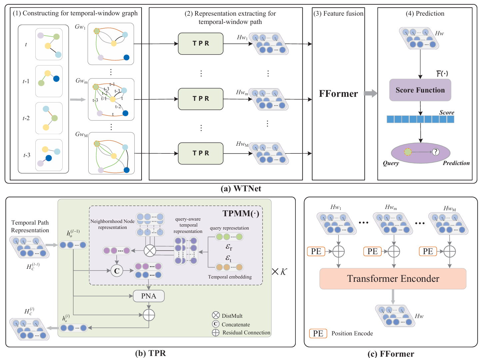

# WTNet: Temporal Knowledge Graph Reasoning Network with Windowing Strategy and Transformer-based Fusion

This is the official code release of the following paper:

 Jiabin Zhang, Min Wangb, Guoqiang Xie and Jianrong Peng



## Quick Start

### Dependencies

```
python==3.8
torch==1.10.0
torchvision==0.11.1
dgl-cu113==0.9.1
tqdm
torch-scatter>=2.0.8
pyg==2.0.4
```

### Train models

0. Switch to `src/` folder
```
cd src/
``` 

1. Run scripts

```
python main.py --gpus 0 -d YAGO --batch_size 6 --n_epoch 30 --lr 0.00005 --hidden_dims 64 64 64 64 --history_len 10 --time_encoding_independent
```
- To run with multiple GPUs which is **highly recommended**, use the following commands
```
python -m torch.distributed.launch --nproc_per_node=4 main.py --gpus 0 1 2 3 -d YAGO --batch_size 6 --n_epoch 30 --lr 0.00005 --hidden_dims 64 64 64 64 --history_len 10 --time_encoding_independent
```
### Evaluate models

To generate the evaluation results of a pre-trained model (if exist), simply add the `--test` flag in the commands above.

```
python main.py --gpus 0 -d YAGO --batch_size 6 --hidden_dims 64 64 64 64 --history_len 10 --time_encoding_independent --test
```


## Citation
If you find the resource in this repository helpful, please cite

```bibtex

```
